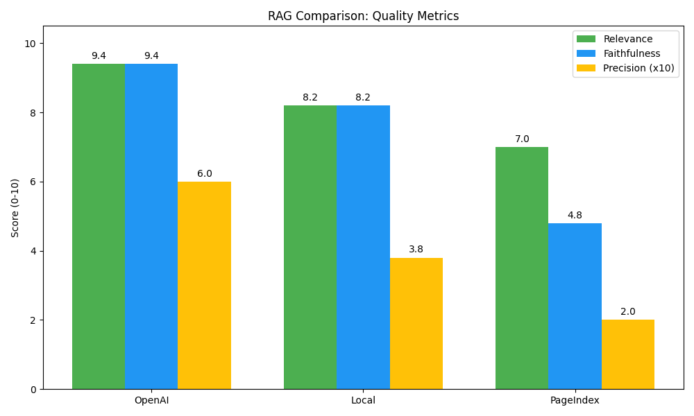
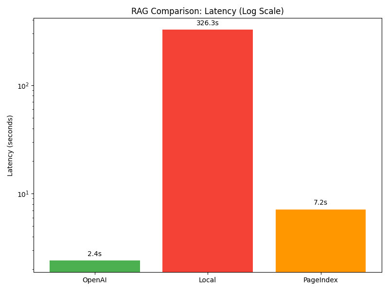

# Medical Transcription RAG Comparison 🩺🤖

A comprehensive benchmarking project designed to evaluate and compare three different **Retrieval-Augmented Generation (RAG)** architectures using clinical medical transcription data.

## 📊 Dataset
The project uses the **Medical Transcriptions (MTSamples)** dataset from Kaggle.
*   **Source**: [Medical Transcriptions on Kaggle](https://www.kaggle.com/datasets/tboyle10/medicaltranscriptions)
*   **Content**: Over 5,000 real-world medical transcriptions covering various medical specialties.
*   **Setup**: Download `mtsamples.csv` and place it in the `data/` directory.

---

## 🏗️ Project Structure & Component Details

### 🛠️ Global Tools (`/tools`)
*   `data_processor.py`: The heart of data handling. Contains functions for cleaning the CSV, normalizing medical text, and performing token-based chunking.
*   `export_to_markdown.py`: Converts CSV rows into individual `.md` files. This is crucial for the PageIndex RAG, which processes documents rather than raw table rows.

### ☁️ OpenAI RAG (`/openai-rag`)
A high-performance implementation using the official OpenAI API.
*   `config.py`: Centralized settings for API keys, model names (`gpt-4o-mini`), and FAISS parameters.
*   `ingest.py`: Loads data, generates embeddings via OpenAI API, and saves them into a FAISS index.
*   `query.py`: Handles the RAG loop: Query -> Embedding -> FAISS Search -> Prompt Augmentation -> LLM Answer.

### 🏠 Local Model RAG (`/local-model-rag`)
A fully private RAG running locally on your machine via Ollama.
*   `config.py`: Local settings for `Llama 3.2` and `mxbai-embed-large`.
*   `ingest.py`: Multi-threaded embedding generation (local) and FAISS indexing. It includes a "self-healing" feature to auto-pull missing models.
*   `query.py`: Uses local LLM for generation.

### 🌳 PageIndex RAG (`/pageindex-rag`)
Advanced reasoning-based RAG using [VectifyAI PageIndex](https://github.com/VectifyAI/PageIndex).
*   `config.py`: Configuration for PageIndex environment.
*   `ingest.py`: Builds a hierarchical tree-index from Markdown documents.
*   `query.py`: Performs reasoning-based retrieval across the document tree.

### � Evaluation Suite (`/evaluation`)
The benchmarking department.
*   `queries.json`: A standard set of 5 medical-domain questions to ensure a fair test.
*   `metrics.py`: Implements "LLM-as-a-judge" logic to score Relevance, Faithfulness, and Retrieval Precision.
*   `compare.py`: The orchestrator script that runs all three systems and generates a final comparison report.


---

## 🚀 Getting Started

### 1. Prerequisites
*   Python 3.10+
*   [Ollama](https://ollama.com/) installed and running (for Local RAG).
*   OpenAI API Key in a `.env` file.

### 2. Installation
```bash
pip install -r requirements.txt
ollama pull llama3.2
ollama pull mxbai-embed-large
```

### 3. Data Preparation
```bash
# Clean original CSV and export to Markdown for PageIndex
python tools/export_to_markdown.py
```

### 4. Ingestion
Run ingestion for each model to build the indices:
```bash
python openai-rag/ingest.py
python local-model-rag/ingest.py
python pageindex-rag/ingest.py
```

---

## 📊 Running Evaluation
To benchmark all models against the standard medical query set:
```bash
python evaluation/compare.py
```

The results will be summarized in the terminal and detailed JSON reports will be saved in `evaluation/results/`.

---

## 🔍 Metrics Tracked
*   **Answer Relevance**: Does the RAG answer the specific medical question?
*   **Faithfulness**: Is the answer derived strictly from the retrieved context? (Anti-hallucination)
*   **Precision@K**: How many of the top retrieved chunks were actually relevant?
*   **Latency**: How many seconds per query?
*   **Cost**: Total API spend for the run.

---

## ⚖️ Next Steps
Run the `compare.py` script to generate the final comparison table. Once the data is ready, this README will be updated with the performance breakdown.

## 🏆 Evaluation Results (February 2026 Run)

The following results were obtained by running `evaluation/compare.py` on the standard query set:

| Feature | OpenAI RAG (gpt-4o-mini) | Local RAG (llama3.2) | PageIndex RAG (Shim) |
| :--- | :--- | :--- | :--- |
| **Avg Relevance** (0-10) | **9.4** | 8.2 | 7.0 |
| **Avg Faithfulness** (0-10) | **9.4** | 8.2 | 4.8 |
| **Avg Precision** (0-1) | **0.60** | 0.38 | 0.20 |
| **Avg Latency** (sec) | **2.40s** | 326.34s | 7.15s |
| **Cost** ($) | ~$0.0017 | **$0.00** | **$0.00** |

### 📊 Performance Charts
> *Visualizations generated by `evaluation/visualize_results.py`*

#### 1. Quality Metrics Comparison
The chart below compares the three RAG systems across **Relevance**, **Faithfulness**, and **Precision** (scaled 0-10). **OpenAI RAG** (Green) leads in all categories, demonstrating superior retrieval accuracy and answer quality. **Local RAG** (Blue) holds its own in terms of quality but lags slightly behind. **PageIndex** (Yellow) shows lower faithfulness, indicating struggles with context usage in this experimental setup.



#### 2. Latency Comparison
This chart highlights the massive disparity in processing speed, using a **logarithmic scale** to fit the data. **OpenAI** is near-instant (~2.4s), whereas the **Local RAG** on CPU takes over 5 minutes (~326s) per query, illustrating the stark trade-off between privacy and speed without hardware acceleration.



### 🧐 Analysis & Key Findings

#### 1. OpenAI RAG (The Gold Standard)
*   **Keywords:** `High Precision`, `Fast`, `Reliable`, `Low Cost`
*   **Performance:** OpenAI demonstrated the highest performance across all quality metrics. It retrieved relevant context 60% of the time (Precision 0.6) and synthesized answers that were deemed highly relevant (9.4) and faithful (9.4) by the LLM judge.
*   **Latency:** It was the fastest system (~2.4s), making it the only viable option for real-time applications among those tested.
*   **Cost:** While not free, the cost for the test set was negligible ($0.0017).

#### 2. Local RAG (The Privacy Choice)
*   **Keywords:** `Private`, `High Latency`, `Good Quality`, `Optimization Needed`
*   **Performance:** The local Llama 3.2 model performed surprisingly well in terms of quality (8.2 score), showing it can understand and answer medical queries effectively.
*   **Latency:** The major bottleneck is speed. At **~5.5 minutes per query** (326s), the current CPU-based inference is too slow for interactive use.
*   **Recommendation:** This approach is viable only with GPU acceleration or further quantization. It proves that privacy-first local RAG is possible for medical data but requires better hardware.

#### 3. PageIndex RAG (The Experimental Approach)
*   **Keywords:** `Structure-Aware`, `Experimental`, `Low Faithfulness`
*   **Performance:** This implementation used a custom "shim" to simulate PageIndex's tree-based retrieval due to library constraints. It underperformed relative to vector-based methods (Relevance 7.0).
*   **Faithfulness Issue:** The low faithfulness score (4.8) indicates a high rate of hallucination or answering without sufficient context. This is likely because the simplified tree-traversal logic (checking top 5 files) missed the relevant documents more often than the vector search.
*   **Potential:** The concept of navigating document structure is powerful, but a robust implementation requires the full commercial PageIndex library or a more sophisticated recursive search agent than the shim provided.

---
